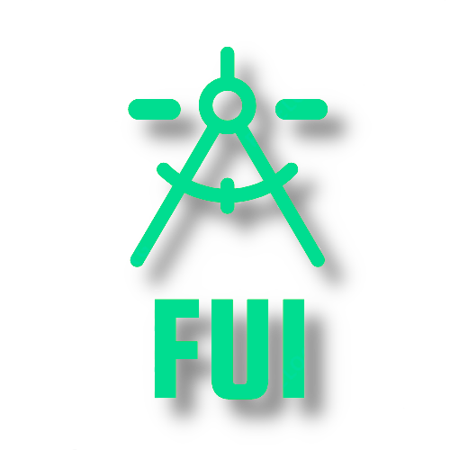
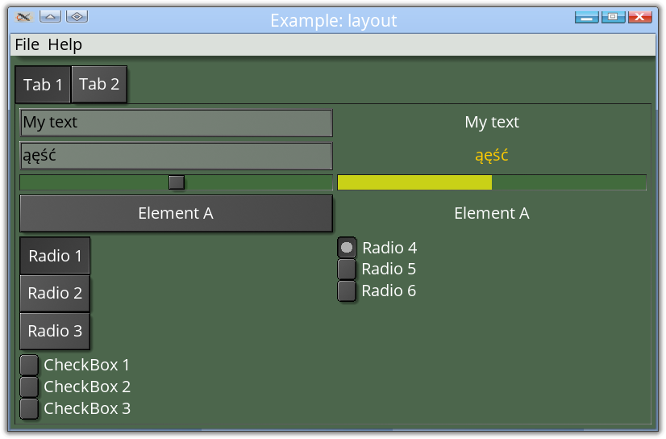

# fui

[](https://crates.io/crates/fui_core)
[](https://docs.rs/fui_core)
[](https://github.com/marek-g/rust-fui/blob/master/LICENSE.md)



MVVM Rust UI Framework Library.

## Documentation

[FUI's documentation](./doc/SUMMARY.md)

## Crates

### `fui_core` [](https://crates.io/crates/fui_core)

Core library of FUI MVVM UI Framework.

### `fui_macros` [](https://crates.io/crates/fui_macros)

Macros for FUI UI Framework.

### `fui_controls` [](https://crates.io/crates/fui_controls)

Standard controls for FUI UI Framework.

### `fui_controls_media` [](https://crates.io/crates/fui_controls_media)

Media controls for FUI UI Framework.

### `fui_system` [](https://crates.io/crates/fui_system)

Cross-platform windowing library focused on good desktop integration (dialogs, menus, tray icons etc.).

### `fui_app` [](https://crates.io/crates/fui_app)

Application backend of FUI UI Framework.

## Screenshots

Note! The visual aspect of the library is a subject to change. Margins are missing. You can also write your own styles and make it look completely different.




## Features

- cross-platform:
  - [x] Linux (x11 & wayland using Qt)
  - [x] Windows (using Qt)
  - [ ] Android
  - [ ] Wasm
- renderer agnostic:
  - [x] `OpenGL` backend
- native elements:
  - [x] multiple windows
  - [x] tray icons
  - [ ] native popup windows
  - [x] fallback to simulated popup windows (rendered in parent window)
- accessibility:
  - [ ] keyboard support
  - [ ] AccessKit
- MVVM model with:
  - [x] properties,
  - [x] bindings,
  - [x] observable collections
- [x] async support
- [x] `ui!` macro for easier view creation
- [x] extensive styling (style can change behavior)

## Example

```rust
#![windows_subsystem = "windows"]

use fui_app::*;
use fui_controls::*;
use fui_core::*;
use fui_macros::ui;

use std::cell::RefCell;
use std::rc::Rc;

use typed_builder::TypedBuilder;
use typemap::TypeMap;
use winit::window::WindowBuilder;

struct MainViewModel {
    pub counter: Property<i32>,
}

impl MainViewModel {
    pub fn new() -> Rc<Self> {
        Rc::new(MainViewModel {
            counter: Property::new(0),
        })
    }

    pub fn increase(&self) {
        self.counter.change(|c| c + 1);
    }
}

impl ViewModel for MainViewModel {
    fn create_view(vm: &Rc<Self>) -> Rc<RefCell<dyn ControlObject>> {
        ui!(
            Horizontal {
                Text { text: (&vm.counter, |counter| format!("Counter {}", counter)) },
                Button {
                    clicked: Callback::new(vm, |vm, _| vm.increase()),
                    Text { text: "Increase" }
                },
            }
        )
    }
}

fn main() -> anyhow::Result<()> {
    let mut app = Application::new("Example: button").unwrap();

    app.add_window(
        WindowBuilder::new().with_title("Example: button"),
        MainViewModel::new(),
    )?;

    app.run();

    Ok(())
}
```

[More examples](./fui_examples)

## License

Licensed under

 * GNU Lesser General Public License, Version 3.0 or later ([LICENSE-GPL-3.0+](https://spdx.org/licenses/GPL-3.0-or-later.html))
 * with Classpath Exception, Version 2.0 ([LICENSE-Classpath-exception-2.0](https://spdx.org/licenses/Classpath-exception-2.0.html)).

It's essentially the GNU GPL except it allows the distribution of an executable with a statically or dynamically linked library under the terms of your choice. The reason it's not LGPL is that dynamic linking is difficult with Rust.

The project is partially based on code from other projects:

 * WPF's [Grid.cs](https://github.com/dotnet/wpf/blob/master/src/Microsoft.DotNet.Wpf/src/PresentationFramework/System/Windows/Controls/Grid.cs) on MIT license

### Contribution

Unless you explicitly state otherwise, any contribution intentionally submitted for inclusion in the work by you, shall be licensed as above, without any additional terms or conditions.
